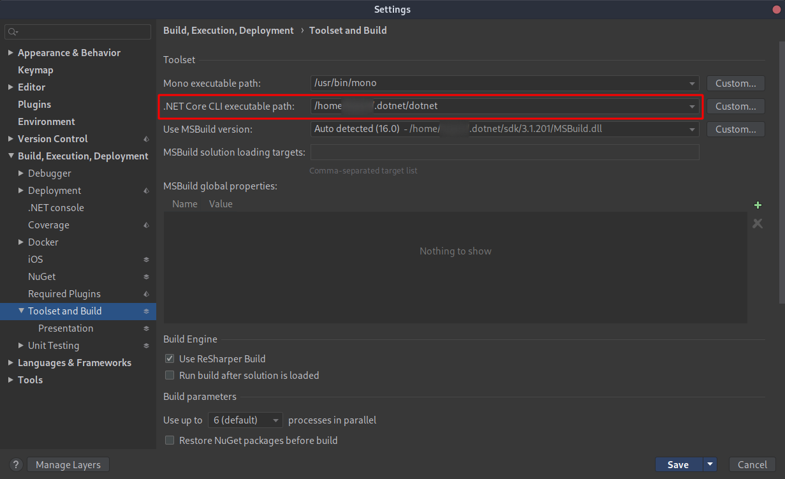

# .NET-Core on Linux (Arch)

## Install Dotnet Runtime and SDK
### Option 1
Via package-manager
```bash
yay -S dotnet-runtime dotnet-sdk
```

For older version, take a look which are available

### Option 2
Via [install-script](https://docs.microsoft.com/en-us/dotnet/core/tools/dotnet-install-script)

```bash
mkdir -p ~/.dotnet
curl https://dotnet.microsoft.com/download/dotnet-core/scripts/v1/dotnet-install.sh -o ~/.dotnet/dotnet-install
chmod u+x ~/.dotnet/dotnet-install
echo "[ -d ~/.dotnet ] && export PATH=$HOME/.dotnet:$PATH" >> ~/.bashrc
source ~/.bashrc
dotnet-install 
```

For older version, take a look into the [docu](https://docs.microsoft.com/en-us/dotnet/core/tools/dotnet-install-script), e.g.
```bash
dotnet-install --channel 2.2
```

## Install nuget-Manager
```bash
yay -S nuget
```

### add custom repo
```bash
nuget sources add -name "example.com" -source "https://example.com/repos/nuget-local/" -username <USERNAME> -password <PASSWORD>
```
* [`nuget` docu](https://docs.microsoft.com/en-us/nuget/reference/nuget-exe-cli-reference)
* [`nuget sources`](https://docs.microsoft.com/en-us/nuget/reference/cli-reference/cli-ref-sources)

## Rider
When local .NET-Core installation, change *executable path* in Rider Settings

**Build, Execution, Deployment** -> **Toolset and Build** -> *.NET Core CLI executable path*


## Additional
Take also a look onto [mono](https://wiki.archlinux.org/index.php/Mono)